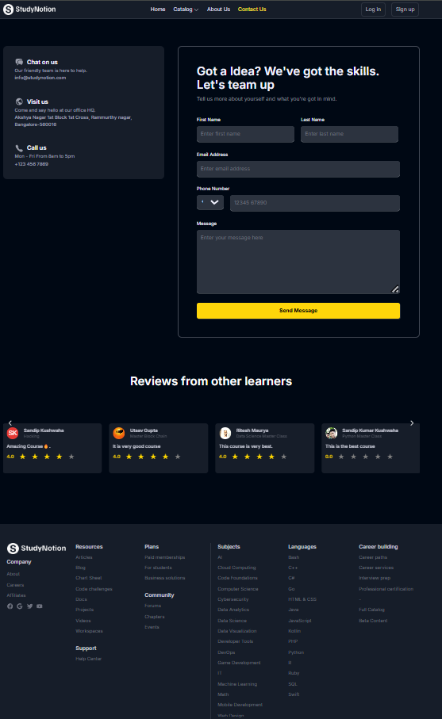
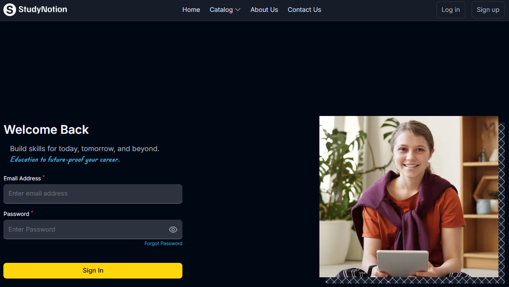
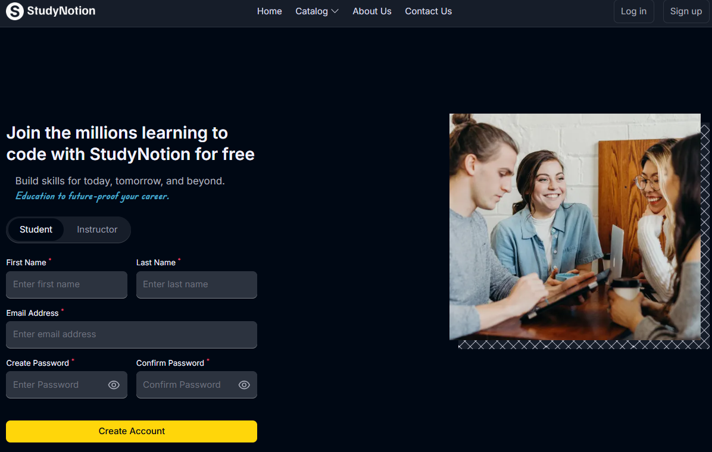
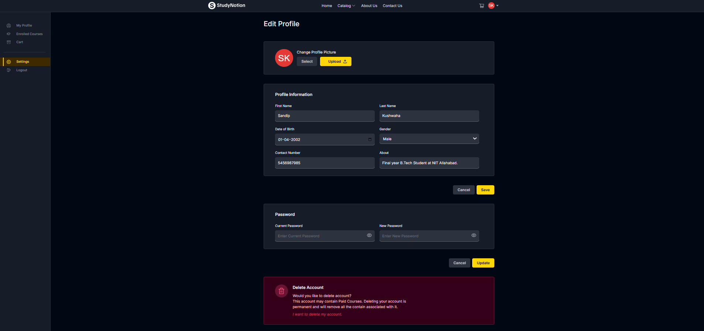
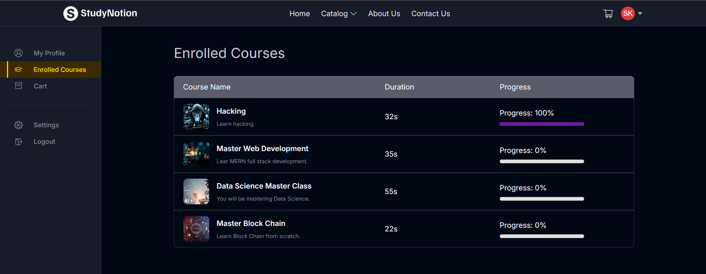
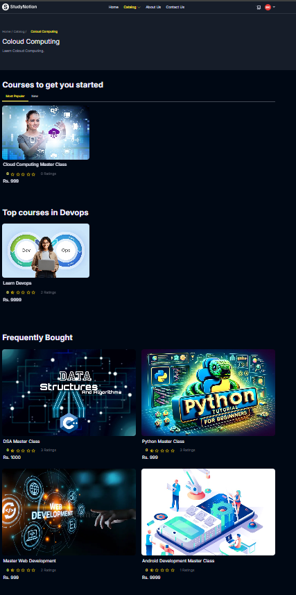
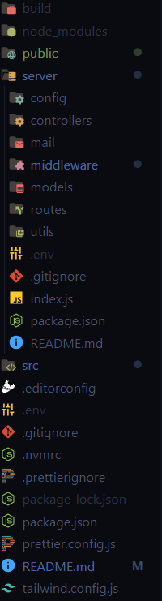

# [StudyNotion](https://studynotion-frontend-sandip.vercel.app/)

StudyNotion is a fully functional **ed-tech platform** designed to enable users to create, consume, and rate educational content. Built with the powerful **MERN stack** (MongoDB, ExpressJS, ReactJS, NodeJS), it aims to deliver an immersive learning experience to students and a robust platform for instructors to showcase their expertise.

---


## Table of Contents
1. [Introduction](#introduction)
2. [Features](#features)
3. [System Architecture](#system-architecture)
4. [Front-end](#front-end)
5. [Back-end](#back-end)
6. [API Design](#api-design)
7. [Deployment](#deployment)
8. [Running the Project](#running-the-project)
9. [Future Enhancements](#future-enhancements)
10. [Conclusion](#conclusion)

---

## Introduction
StudyNotion strives to make education more accessible and engaging by providing:
- A seamless and interactive learning experience for students.
- A platform for instructors to showcase their expertise and connect with learners worldwide.


 




---

## Features
- **For Students:**
  - Browse courses with descriptions and ratings.
  - Add courses to wishlist or cart and complete purchases.
  - Access detailed course content (videos, documents, etc.).
  - Manage user details and edit profile.

- **For Instructors:**
  - Manage courses (create, update, delete, and edit content).
  - Access insights on course performance (views, clicks, ratings).
  - Edit profile details.

- **For Admin (Future Scope):**
  - Monitor platform metrics like revenue and user statistics.
  - Manage instructors and users.



 <!-- Add a comprehensive image of the platform features -->

---

## System Architecture
The platform follows a **client-server architecture**, comprising:
1. **Front-end** (ReactJS): Handles user interface and interactions.
2. **Back-end** (NodeJS, ExpressJS): Manages APIs and business logic.
3. **Database** (MongoDB): Stores user data, courses, and media.

 <!-- Add architecture diagram -->

---

## Front-end
The front-end is designed for responsiveness and interactivity using:
- **ReactJS**: Component-based architecture.
- **Tailwind CSS**: Styling for a clean and responsive UI.
- **Redux**: State management for scalable applications.

### Key Pages for Students:
1. **Homepage**: Brief introduction to the platform.
2. **Course List**: Browse all available courses.
3. **Wishlist/Cart Checkout**: Manage and purchase courses.
4. **User Details/Edit**: Manage profile.

### Key Pages for Instructors:
1. **Dashboard**: Overview of instructor's courses.
2. **Course Management**: CRUD operations for courses.
3. **Insights**: Detailed course performance metrics.


 

---

## Back-end
The back-end is built using:
- **Node.js**: JavaScript runtime for server-side logic.
- **Express.js**: Framework for API handling.
- **MongoDB**: Flexible NoSQL database for data storage.

### Features:
- User authentication (JWT and Bcrypt for security).
- Course management (CRUD operations for instructors).
- Payment gateway integration using Razorpay.
- Cloud media storage with Cloudinary.

### Database Schemas:
1. **Student**: Name, email, password, enrolled courses.
2. **Instructor**: Name, email, password, created courses.
3. **Course**: Title, description, media content, ratings.

[Database Schema](https://github.com/Sandipkushwaha20/StudyNotion/tree/main/server/models) 

---

## API Design
The platform's API adheres to REST principles, supporting CRUD operations and secure data exchange.

#### Sample Endpoints:
| Endpoint               | Method | Description                           |
|------------------------|--------|---------------------------------------|
| `/api/auth/signup`     | POST   | Create a new user account             |
| `/api/auth/login`      | POST   | Log in and generate a JWT token       |
| `/api/courses`         | GET    | Retrieve all available courses        |
| `/api/courses/:id`     | GET    | Retrieve course details by ID         |
| `/api/courses/:id/rate`| POST   | Add a rating to a course              |


---
## Deployment
- **Front-end**: Hosted on [Vercel](https://vercel.com).
- **Back-end**: Hosted on [Render](https://render.com) or [Railway](https://railway.app).
- **Database**: MongoDB Atlas for reliable and scalable data storage.
- **Media**: Cloudinary for image and video management.


---

## Running the Project
To set up and run the project locally:

1. Clone the repository:
   ```bash
   git clone https://github.com/Sandipkushwaha20/StudyNotion
   cd studynotion
   ```

2. Install dependencies:
   ```bash
   npm install
   ```

3. Set up environment variables:
   - Create a `.env` file in the root directory.
   - Add your environment variables (e.g., database URL, JWT secret, etc.).

   ### Environment Variables

    #### To run this project, you need to configure the following environment variables in a `.env` file *in the server folder* of your project directory:

    <!-- ```plaintext -->
    ##### Mail Configuration
   - MAIL_HOST=           # Host address for your email provider (e.g., smtp.example.com)
   - MAIL_USER=           # Email address or username for authentication
   - MAIL_PASS=           # Password or App-specific password for authentication

    ##### JWT Configuration
   - JWT_SECRET=          # Secret key for signing JWT tokens

    ##### Folder Configuration
   - FOLDER_NAME=         # Name of the folder where files will be stored

    ##### Razorpay Payment Gateway
   - RAZORPAY_KEY=        # Razorpay API key
   - RAZORPAY_SECRET=     # Razorpay secret key

    ##### Cloudinary Configuration
   - CLOUD_NAME=          # Your Cloudinary cloud name
   - API_KEY=             # Your Cloudinary API key
   - API_SECRET=          # Your Cloudinary API secret

    ##### MongoDB Configuration
   - MONGODB_URL=         # MongoDB connection string

    ##### Server Configuration
   - PORT=4000            # Port on which the server will run

   #### Add another `.env` file *outside the server folder*

    ##### React App Base URL
   - REACT_APP_BASE_URL=  # Base URL for the backend API (e.g., https://api.example.com)

    ##### Razorpay Configuration
   - RAZORPAY_KEY=        # Razorpay API key for payment processing

    


4. Start the development server:
   ```bash
   npm run dev
   ```

The application will be available at `http://localhost:3000`.


---

## Future Enhancements
1. **Gamification**: Add badges, points, and leaderboards to increase engagement.
2. **Personalized Learning Paths**: Tailored course recommendations based on user interests.
3. **Mobile App**: Develop native applications for iOS and Android.
4. **AI-Powered Features**: Use machine learning for personalized recommendations.
5. **AR/VR Integration**: Immersive learning experiences for certain courses.


---

## Conclusion
StudyNotion leverages modern web technologies to offer a robust and user-friendly ed-tech platform. While it already supports a comprehensive feature set, its planned future enhancements will make it even more engaging and impactful for students and instructors.

---


## Contact
For more details or contributions, reach out at: **[sandipkushwaha2437@gmail.com](mailto:sandipkushwaha2437@gmail.com)**


